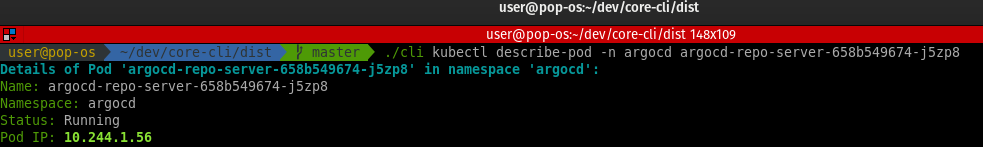
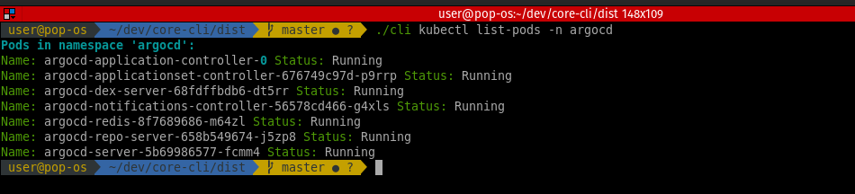

# KIND, ArgoCD, Jenkins, and Kubernetes CLI

This CLI tool allows you to manage KIND clusters, ArgoCD applications, Jenkins jobs and Kubernetes efficiently using Python. It provides functionality for working with Docker containers, KIND clusters, ArgoCD applications, Jenkins jobs and Kubernetes clusters.

## Features

1. **KIND Cluster Management:**
    - Get the Docker container running KIND cluster.
    - Execute `crictl` commands in KIND Docker container.
    - Load Docker images into KIND clusters.
    - WIP ...

2. **ArgoCD Management:**
    - Template a new service by creating an `ApplicationSet`.
    - Load an ArgoCD project application from a local file.
    - List all applications and select the applications to sync.
    - WIP ...

3. **Jenkins Management:**
    - Get details of a Jenkins job.
    - Trigger a Jenkins job build.
    - List all Jenkins jobs.
    - WIP ...

4. **Kubernetes Management:**
    - list pods.
    - Describe pods.
    - Delete pods.
    - WIP ...

## Requirements

- Python 3.9
- Docker
- KIND
- crictl
- ArgoCD CLI
- Jenkins API Python library (`jenkinsapi`)
- Kubernetes

## Installation

1. **Clone the repository:**

    ```sh
    git clone https://github.com/zrougamed/core-cli.git
    cd core-cli
    ```

2. **Install dependencies:**

    ```sh
    pip install -r requirements.txt
    ```

3. **Compile the CLI using PyInstaller:**

    ```sh
    pyinstaller --onefile cli.py
    ```

    This will generate an executable in the `dist` directory.

## Usage

The CLI has these main commands: `kind`, `argocd`, `jenkins` and `kubernetes`, each with their respective subcommands.

### KIND Commands

1. **Get Docker Container:**

    ```sh
    ./dist/cli kind get-container <container_name>
    ```

    Retrieves the Docker container running the KIND cluster.

2. **Execute crictl Command:**

    ```sh
    ./dist/cli kind exec-crictl <container_id> <crictl_command>
    ```

    Executes a `crictl` command in the specified KIND Docker container.

3. **Load Docker Image into KIND Cluster:**

    ```sh
    ./dist/cli kind load-image <cluster_name> <image>
    ```

    Loads a Docker image into the specified KIND cluster.

### ArgoCD Commands

1. **Template Service:**

    ```sh
    ./dist/cli argocd template-service <service_name> <project_name> <repo_url> <path>
    ```

    Templates a new service by creating an `ApplicationSet` for ArgoCD.

2. **Load Application from Local File:**

    ```sh
    ./dist/cli argocd load-application <app_name> <file_path>
    ```

    Loads an ArgoCD project application from a local file.

3. **List and Sync Applications:**

    ```sh
    ./dist/cli argocd list-sync
    ```

    Lists all ArgoCD applications and allows you to select and sync them.

### Jenkins Commands

1. **Get Job Details:**

    ```sh
    ./dist/cli jenkins get-job <url> <username> <password> <job_name>
    ```

    Retrieves the details of a specified Jenkins job.

2. **Trigger Job Build:**

    ```sh
    ./dist/cli jenkins build-job <url> <username> <password> <job_name>
    ```

    Triggers a build for the specified Jenkins job.

3. **List All Jobs:**

    ```sh
    ./dist/cli jenkins list-jobs <url> <username> <password>
    ```

    Lists all jobs on the specified Jenkins server.

## Kubernetes Commands

1. **List Pods:**

    ```sh
    ./dist/cli kubectl list-pods [--namespace <namespace>]
    ```

    Lists pods in the specified namespace. Default namespace is 'default'.

2. **List Services:**

    ```sh
    ./dist/cli kubectl list-services [--namespace <namespace>]
    ```

    Lists services in the specified namespace. Default namespace is 'default'.

3. **Delete Pod:**

    ```sh
    ./dist/cli kubectl delete-pod <pod_name> [--namespace <namespace>]
    ```

    Deletes the specified pod in the specified namespace. Default namespace is 'default'.

4. **Describe Pod:**

    ```sh
    ./dist/cli kubectl describe-pod <pod_name> [--namespace <namespace>]
    ```

    Describes the specified pod in the specified namespace. Default namespace is 'default'.


## Example

1. **Get Docker Container:**

    ```sh
    ./dist/cli kind get-container kind-control-plane
    ```

    Output:
    ```
    Container ID: abc123def456
    ```

2. **Execute crictl Command:**

    ```sh
    ./dist/cli kind exec-crictl abc123def456 crictl images
    ```

3. **Load Docker Image into KIND Cluster:**

    ```sh
    ./dist/cli kind load-image kind-cluster my-image:latest
    ```

4. **Template Service:**

    ```sh
    ./dist/cli argocd template-service my-service my-project https://github.com/<username>/service
    ```

5. **Load Application from Local File:**

    ```sh
    ./dist/cli argocd load-application my-app /path/to/app.yaml
    ```

6. **List and Sync Applications:**

    ```sh
    ./dist/cli argocd list-sync
    ```

7. **Get Jenkins Job Details:**

    ```sh
    ./dist/cli jenkins get-job http://jenkins.example.com username password my-job
    ```

8. **Trigger Jenkins Job Build:**

    ```sh
    ./dist/cli jenkins build-job http://jenkins.example.com username password my-job
    ```

9. **List All Jenkins Jobs:**

    ```sh
    ./dist/cli jenkins list-jobs http://jenkins.example.com username password
    ```

## Contributing

Contributions are welcome! Please submit a pull request or open an issue to discuss your ideas.

## License

This project is licensed under the MIT License.


## Screenshots 





